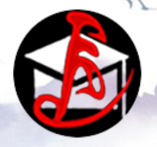

<html lang="en" itemscope="" itemtype="https://schema.org/WebPage"><head><meta http-equiv="Content-Type" content="text/html; charset=UTF-8"><meta name="generator" content="Hugo 0.54.0"><meta http-equiv="x-ua-compatible" content="IE=edge"><meta name="viewport" content="width=device-width,initial-scale=1,shrink-to-fit=no"><meta name="theme-color" content="#466BB0"><meta name="title" content="LAS_AI"><meta name="description" content="LAS Analytics Powered by AI."><meta name="keywords" content="Latin America,big data,analysis,AI"><meta property="og:title" content="LAS_AI"><meta property="og:type" content="website"><meta property="og:description" content="LAS Analytics Powered by AI."><meta property="og:url" content="http://www.logpai.com">
<title>LAS-AI: Latin America Big Data Analytics Powered by AI.</title>
<link rel="shortcut icon" href="icon.png">

<link rel="stylesheet" href="css">
<!-- Bootstrap Core CSS -->
<link href="bootstrap.css" rel="stylesheet">
<link rel="stylesheet" href="all.css">

<!-- Custom Fonts -->
<link href="font-awesome.min.css" rel="stylesheet" type="text/css">
<link href="css(1)" rel="stylesheet" type="text/css">
<link href="css(2)" rel="stylesheet" type="text/css">
</head>

<body class="language-unknown" data-new-gr-c-s-check-loaded="14.1045.0" data-gr-ext-installed="">
<header><nav><a id="brand" href="http://www.logpai.com/">

    <svg viewBox="0 0 300 300"><circle cx="150" cy="150" r="146" stroke-width="2"></circle><path d="M60 220L130 60 h70 L130 220 z"></path><path d="M120 220 h110 l25 -50 h-110z"></path></svg>

LAS_AI</a>

<svg class="icon"><use xlink:href="https://istio.io/img/icons.svg#hamburger"></use></svg>

</nav></header>

<main class="landing">
<!-- 

  <svg id="hero-logo" viewBox="0 0 160 240"><path d="M0 210H160L60 240z"></path><path d="M0 2e2l60-10V80z"></path><path d="M70 190l90 10L70 0z"></path></svg>
  
<h1 id="hero-label">LOGPAI</h1><h1 id="hero-lead">- Log Analytics Powered by AI -</h1>

 -->

    
 

 

        
    

  <h1 class="section-heading">Latin America Big Data Service Powered by AI
                    
</h1>

<a href="https://github.com/logpai/loghub">
<svg class="landing-image" viewBox="0 0 1200 900"><defs></defs><circle cx="149.5" cy="149.5" r="50"></circle><circle cx="149.5" cy="750.5" r="50"></circle><path d="M240 120l-30 30 30 30V120z"></path><path d="M240 720l-30 30 30 30V720z"></path><path class="cls-1" d="M250 150c2e2.0 5e2 3e2 7e2 3e2"></path><path class="cls-1" d="M250 750c2e2.0 499-3e2 7e2-3e2"></path><path class="cls-1" d="M250 750H950z"></path><path class="cls-1" d="M250 150H950z"></path><path class="cls-2" d="M950 150c-2e2.0-5e2 3e2-7e2 3e2"></path><path class="cls-2" d="M950 750c-2e2.0-499-3e2-7e2-3e2"></path><path class="cls-2" d="M250 450H950z"></path><path class="cls-3" d="M340 450H950z"></path><path class="cls-4" d="M950 150c-2e2.0-5e2 3e2-7e2 3e2"></path><path class="cls-4" d="M950 750c-2e2.0-499-3e2-7e2-3e2"></path><circle class="cls-5" cx="149.5" cy="449.5" r="50"></circle><circle class="cls-5" cx="1050.5" cy="149.5" r="50"></circle><circle class="cls-5" cx="1050.5" cy="750.5" r="50"></circle><circle class="cls-6" cx="1050.5" cy="449.5" r="50"></circle><path class="cls-5" d="M240 420l-30 30 30 30V420z"></path><path class="cls-6" d="M960 480l30-30-30-30v60z"></path><path class="cls-5" d="M960 180l30-30-30-30v60z"></path><path class="cls-5" d="M960 780l30-30-30-30v60z"></path></svg>

<h5 class="panel-title">LAS_HUB</h5>
<h5 class="panel-title">A hub of open-sourced LAS-related datasets downloading.</h5>

</a>

<a href="https://github.com/logpai/logparser">
<svg class="landing-image" viewBox="0 0 1200 900"><defs></defs><path d="M1e2 277.57V320H142.43L1e2 277.57z"></path><path d="M210 587.57V630H252.43L210 587.57z"></path><path d="M890.5 329.07V371.5H932.93L890.5 329.07z"></path><path d="M1e2 795c84.32-10.77 165-40.47 241.15-77.37C476.51 652 603.47 561.86 751.25 525.42c117.73-29 287.93-22.63 349.46 102 2.07 4.19 3.6 8.49 5.42 12.77l-6.64 3.86c-36.75-34.34-82.24-55.82-131.45-65.17-53.63-10.2-108.94-7-162.24 3.64-50.57 10.12-99.64 26.81-147.29 46.36C574.75 663.27 494.88 706.24 411.75 742c-82 35.28-168.81 63.89-258.89 65.28A468 468 0 0 1 95 804.45v-8.86C96.67 795.4 98.33 795.19 1e2 795z"></path><path class="r-1" d="M1e2 650s57.21 62.93 150 93.6"></path><path class="r-1" d="M129.95 290.92 320.87 1e2z"></path><path class="r-1" d="M7e2 141.13 741.13 1e2z"></path><path class="r-1" d="M240 6e2 590 251.1z"></path><path class="r-1" d="M920 340.13l180-181z"></path><path class="r-2" d="M560.21 510.56 682.41 461.91 630.82 237.77 560.21 510.56z"></path><path class="r-2" d="M692.15 459.66 872.05 438.78 604.68 79.6 692.15 459.66z"></path><path class="r-2" d="M714.75 524.54c16.31-5 32.76-9.5 49.56-13.38l110-62.63L562.45 520.3l97 23.49C677.6 536.77 696 530.3 714.75 524.54z"></path><path class="r-2" d="M296 282.57V325H338.43L296 282.57z"></path><path class="r-2" d="M450.5 557.07V599.5H492.93L450.5 557.07z"></path><path class="r-3" d="M477 8e2c1e2-30 211-101.14 330-124 250-48 293 102 293 102"></path><path class="r-3" d="M100.43 520.43 240.87 380z"></path><path class="r-4" d="M325.5 294.5 520 1e2z"></path><path class="r-3" d="M800.13 249.13 950.02 1e2z"></path><path class="r-4" d="M481 569 520.33 530.33z"></path><path class="r-4" d="M1004.63 474.63l94.88-95.12z"></path></svg>

<h5 class="panel-title">LAS_Annotator</h5>
<h5 class="panel-title">A toolkit for automating LAS-related datasets annotating.</h5>

</a>

<a href="https://github.com/logpai/loglizer">
<svg class="landing-image" viewBox="0 0 1200 900"><defs></defs><path d="M390 480l30-30-30-30v60z"></path><path class="p-1" d="M380 450H1e2z"></path><path class="p-1" d="M380 580c-110 0-180 220-280 220"></path><path d="M1070 480l30-30-30-30v60z"></path><path class="p-1" d="M790 450h270z"></path><path class="p-1" d="M790 320h270z"></path><path class="p-1" d="M790 580h270z"></path><path d="M1069 610l30-30-30-30v60z"></path><path d="M390 610l30-30-30-30v60z"></path><path d="M390 350l30-30-30-30v60z"></path><path class="p-1" d="M380 320c-110 0-180-219.46-280-219.46"></path><path d="M1069.5 350l30-30-30-30v60z"></path><path d="M455.37 455v72.52c0 85.52 114.17 133 139.63 142.57V455z"></path><path class="p-2" d="M595 445V202.77L455.37 280V445z"></path><path d="M744.6 445c0-82.16-.1-165.19-.1-165.19L605 202.76V445z"></path><path class="p-3" d="M605 455V670.09c25.46-9.53 139.63-57.05 139.63-142.57v-.26c0-22 0-46.94.0-72.26z"></path></svg>

<h5 class="panel-title">LAS_Analyser</h5>
<h5 class="panel-title">A toolkit for automating LAS-related datasets analysis. </h5>

</a>

<a href="https://github.com/logpai/Log3C">
<svg class="landing-image" viewBox="0 0 1200 900"><defs></defs><path class="m-1" d="M666.46 512.46c-105.09 105.1-221 171.4-299.72 208.52C314 745.86 261.91 765.12 214.26 777.75A202 202 0 0 0 254 747l1.46-1.45c85.64-80.87 146-107.14 222.5-140.39 52.38-22.79 112.8-49.07 194.31-98.42Q669.35 509.59 666.46 512.46z"></path><path class="m-2" d="M1103 3e2c-280 0-183 120-513 186S340 8e2 1e2 8e2"></path><path class="m-2" d="M1103 160c-137 0-136.65 130.87-263 226C5e2 642 432 572 252 742"></path><path class="m-2" d="M250.49 743.49C216.2 777.16 172.84 8e2 1e2 8e2"></path><path class="m-2" d="M1e2 8e2c137 0 390-104 570-284s430-77 430-77"></path><path class="m-2" d="M474.34 668.6C695.34 535.6 817 439 11e2 439"></path><path class="m-3" d="M830 1e2V8e2z"></path><path class="m-4" d="M830 1e2V8e2z"></path><ellipse cx="150" cy="148.55" rx="50" ry="50.47"></ellipse><path d="M391.65 171.25 355.69 193.98 378.21 230.28 391.65 171.25z"></path><path d="M215.97 289.64 179.56 267.66 157.79 304.41 215.97 289.64z"></path><circle class="m-5" cx="220" cy="430" r="50"></circle><circle class="m-1" cx="635" cy="256" r="50"></circle><path class="m-1" d="M424.37 376.1 441.35 337.22 402.47 320.24 424.37 376.1z"></path><path class="m-6" d="M404.19 352.78 276.07 406.49z"></path><path class="m-6" d="M578.89 279.53 448.03 334.39z"></path><path class="m-2" d="M177.73 260.9 164.55 208.2z"></path><path class="m-2" d="M205.37 371.49 189.22 306.86z"></path><path class="m-2" d="M394.71 203.48 576.12 243.13z"></path><path class="m-2" d="M208.7 162.83 347.94 193.26z"></path></svg>

<h5 class="panel-title">LAS_Visualization</h5>
<h5 class="panel-title">A toolkit for automating LAS-related visualization. </h5>

</a>

<a title="LAS_AI datasets are available for downloading." class="btn" href="https://doi.org/10.5281/zenodo.1144100">DOWNLOAD DATASETS</a>
<a title="Learn more about LAS_AI projects." class="btn" href="https://github.com/LAS-AI">FOLLOW GITHUB REPO</a>

</main>

<section id="publication" class="bg-light-white">
        

            

                

                    
                    <h1 class="section-heading">SELECTED PUBLICATIONS
                    
</h1>

                    <ul>

                  <li>
                            
[<strong>AL'2006</strong>] Cameron L, <b>Deignan A.</b> <a target="_blank" href="https://academic.oup.com/applij/article-abstract/27/4/671/156148">The emergence of metaphor in discourse. </a>, <em>Applied linguistics(AL).</em> [<strong><b>Citation: 407</b></strong>]

                        </li>
                        
                        <li>
                            
[<strong>DGM'2008</strong>] <b>Deignan, Alice</b>. <a target="_blank" href="https://www.degruyter.com/document/doi/10.1515/9783110199895.106/html">The grammar of linguistic metaphors. </a>, <em>De Gruyter Mouton(DGM).</em> [<strong><b>Citation: 155</b></strong>]

                        </li>

                        <li>
                            
[<strong>CUP'2013</strong>] <b>Deignan, Alice</b>, Jeannette Littlemore, and Elena Semino.  <a target="_blank" href="https://www.google.com/books?hl=zh-CN&amp;lr=&amp;id=P3GcEZ4jlrwC&amp;oi=fnd&amp;pg=PR1&amp;dq=alice+deignan&amp;ots=nd_RFsRQhS&amp;sig=jkiXz-3jc5dtujhadpcEy2-TbsQ">Figurative language, genre and register. </a>, <em>Cambridge University Press(CUP).</em> [<strong><b>Citation: 150</b></strong>]

                        </li>

                        <li>
                            
[<strong>JBP'2010</strong>] Low, G., <b>Deignan, A</b>., Cameron, L., &amp; Todd, Z. (Eds.) <a target="_blank" href="https://www.google.com/books?hl=zh-CN&amp;lr=&amp;id=60_XS7VwukAC&amp;oi=fnd&amp;pg=PR1&amp;dq=alice+deignan&amp;ots=UquPaPYrAH&amp;sig=9D7C8XGc9TuSPHVOuHDJ7q5hEnU">Researching and applying metaphor in the real world. </a>, <em>J. Benjamins Pub(JBP).</em> [<strong><b>Citation: 150</b></strong>]

                        </li>

                        <li>
                            
[<strong>JBP'2005</strong>] <b>Deignan</b>, Alice. <a target="_blank" href="https://books.google.com.hk/books?hl=zh-CN&amp;lr=&amp;id=bp3dHiJEUNQC&amp;oi=fnd&amp;pg=PR1&amp;ots=ilk88FPZRB&amp;sig=vqqVruTY2wG3AQJppSjqePKGU04&amp;redir_esc=y">Metaphor and corpus linguistics. </a>, <em>J. Benjamins Pub(JBP).</em> [<strong><b>Citation: 1647</b></strong>]

                        </li>

                        <li>
                            
[<strong>RAM'1999</strong>] <b>Deignan, Alice</b>. <a target="_blank" href="https://academic.oup.com/eltj/article-abstract/51/4/352/433845">Corpus-based research into metaphor. </a>, <em>Researching and applying metaphor(RAM).</em>[<strong><b>Citation: 302</b></strong>]

                        </li>

                        <li>
                            
[<strong>ELTJ'1997</strong>] <b>Deignan, Alice</b>, Danuta Gabryś, and Agnieszka Solska. <a target="_blank" href="https://books.google.com.hk/books?hl=zh-CN&amp;lr=&amp;id=bp3dHiJEUNQC&amp;oi=fnd&amp;pg=PR1&amp;ots=ilk88FPZRB&amp;sig=vqqVruTY2wG3AQJppSjqePKGU04&amp;redir_esc=y">Teaching English metaphors using cross-linguistic awareness-raising activities. </a>, <em>ELT journal (ELTJ).</em> [<strong><b>Citation: 402</b></strong>]

                        </li>
            
                        <li>
                            
[<strong>JP'2004</strong>] <b>Deignan, Alice</b>, and Liz Potter. <a target="_blank" href="https://www.tandfonline.com/doi/abs/10.1207/S15327868MS1803_02">A corpus study of metaphors and metonyms in English and Italian. </a>, <em>Journal of pragmatics(JP).</em> [<strong><b>Citation: 186</b></strong>]

                        </li>

                        <li>
                            
[<strong>MS'2013</strong>] Semino, Elena, <b>Deignan, Alice</b>, and Jeannette Littlemore. <a target="_blank" href="https://www.tandfonline.com/doi/abs/10.1080/10926488.2013.742842">Metaphor, genre, and recontextualization. </a>, <em>Metaphor and symbol (MS).</em> [<strong><b>Citation: 92</b></strong>]

                        </li>

                        <li>
                            
[<strong>MS'2006</strong>] Skorczynska, Hanna, and  <b>Deignan, Alice</b>. <a target="_blank" href="https://www.tandfonline.com/doi/abs/10.1207/s15327868ms2102_2">Readership and purpose in the choice of economics metaphors. </a>, <em>Metaphor and symbol (MS).</em> [<strong><b>Citation: 154</b></strong>]

                        </li>
            
            <li>
                            
[<strong>MS'2003</strong>] <b>Deignan A.</b> <a target="_blank" href="https://www.tandfonline.com/doi/abs/10.1207/S15327868MS1804_3">Metaphorical expressions and culture: An indirect link. </a>, <em>Metaphor and symbol (MS).</em> [<strong><b>Citation: 271</b></strong>]

                        </li>

                        <li>
                            
[<strong>MS'2003</strong>] Cameron, Lynne, and  <b>Deignan, Alice</b>. <a target="_blank" href="https://www.tandfonline.com/doi/abs/10.1207/S15327868MS1803_02">Combining large and small corpora to investigate tuning devices around metaphor in spoken discourse. </a>, <em>Metaphor and symbol (MS).</em>[<strong><b>Citation: 269</b></strong>]

                        </li>

                        <li>
                            
[<strong>MS'1999</strong>] <b>Deignan, Alice</b>. <a target="_blank" href="https://www.tandfonline.com/doi/abs/10.1207/s15327868ms1401_3">Linguistic metaphors and collocation in nonliterary corpus data. </a>, <em>Metaphor and symbol (MS).</em> [<strong><b>Citation: 78</b></strong>]

                        </li>

                    </ul>
                

            

        

        <!-- /.container -->

</section>

<section id="team" class="bg-light-gray">
        

            

                

                    <h1 class="section-heading">TEAM
                    
</h1>
                    

                

            

            

                <!-- 
 -->
                    

                        

                            
                            <a target="_blank" href="http://www.cse.cuhk.edu.hk/lyu/">Dongman Cai</a>
                            
Postdoc, GDUFS Phd., University of Leeds 

                        

                    

                    

                        

                            
                            <a target="_blank" href="https://jiemingzhu.github.io/">Wenzhong Zhu</a>
                            
Prof, GDUFS Head of School of Business, GDUFS

                        

                    

                    
                    

                        

                            
                            <a target="_blank" href="https://pinjiahe.github.io/">Pinjia He</a>
                            
Assistant Prof, CUHK Postdoc, ETH Ph.D., CUHK

                        

                    

                        

                            
                            <a target="_blank" href="https://github.com/SCUT-CCNL">Jiabing Fu</a>
                            
Ph.D., SCUT

                        

                    

                    
                

                        

                            
                            <a target="_blank" href="https://shilinhe.github.io/">Cheng Hu</a>
                            
Postdoc, GZHU Ph.D., University of Lincoin

                        

                    
<!-- 
 -->
            
     
        

</section>

<section id="sponsors" class="bg-light-white">
        

            

                

                    <h1 class="section-heading">SPONSORS
                    
</h1>
                    

                

            

            

                <!-- 
 -->
                    

                            
                             
                    

                    

                            
                             
                    

            

        

</section>

<footer>

Latin America Big Data Service Platform is built &amp; maintained by LAS_AI TEAM @Center of Latin America in GDUFS , The Website Theme copied from <a href="https://istio.io/">Istio.io</a>

</footer>

<audio controls="controls" style="display: none;"></audio></body></html>